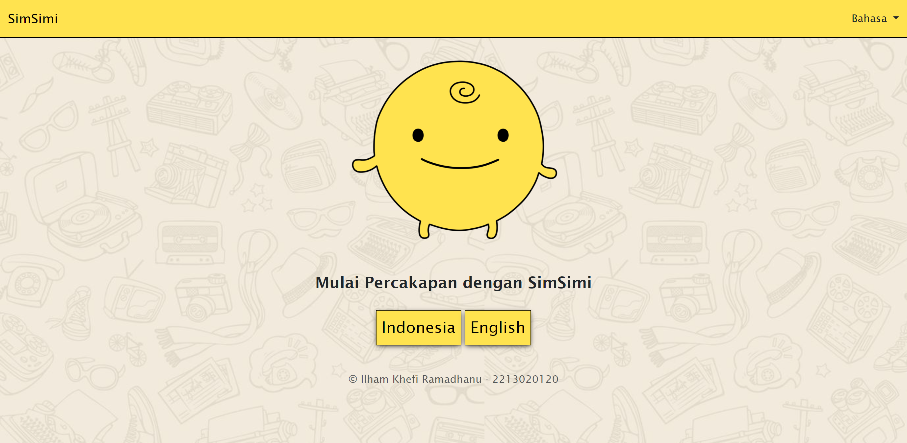
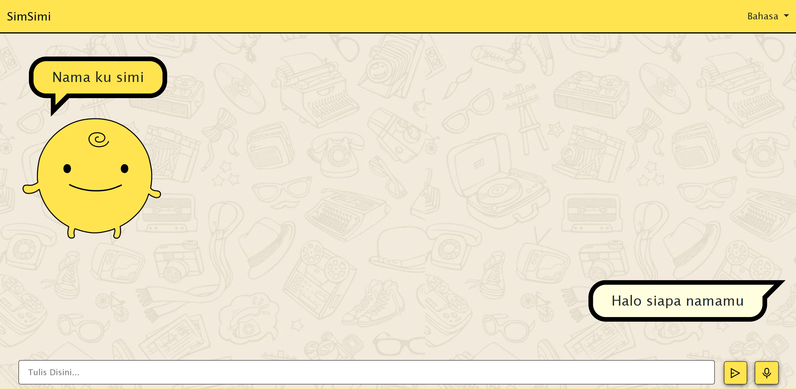
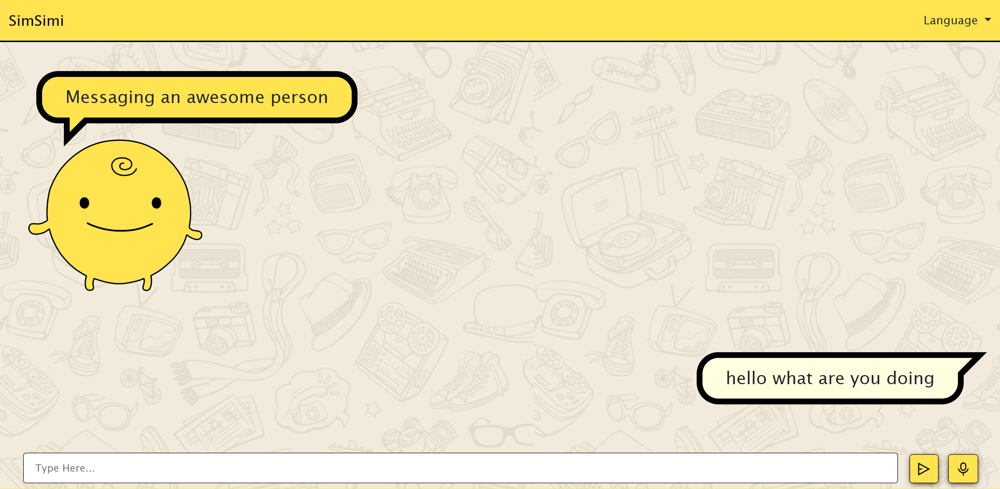

<h1>SIMPLE SIMSIMI</h1>
<p>Aplikasi chatting sederhana berinteraksi dengan bot SimSimi, dilengkapi dengan fitur voice chat untuk percakapan yang lebih menyenangkan</p><br><br>

<h3>=== PREVIEW ===</h3>
<P><strong>Main Menu :</strong></P>

<P><strong>Bahasa Indonesia :</strong></P>

<P><strong>English :</strong></P>

<br><br>
<h3>=== PANDUAN INSTALASI PROGRAM ===</h3>
<p>1. Memastikan laptop terinstall node.js</p>
<p>2. Membuka terminal dan mengarahkan pada path folder</p>
<p>3. Memasukkan perintah 'npm install' untuk menginstall library yang diperlukan</p>

```bash
npm install

```
<p>4. Lalu mengetikkan 'node server.js' pada terminal untuk menjalankan server program</p>

```bash
node server.js

```
<p>5. Setelah server berjalan, membuka web browser dan mengakses <strong>localhost:3000</strong></p>
<p>6. Program siap digunakan</p>
